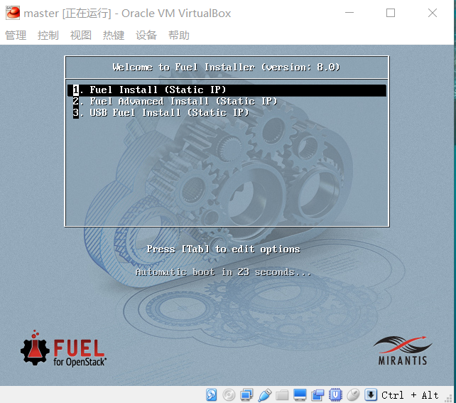
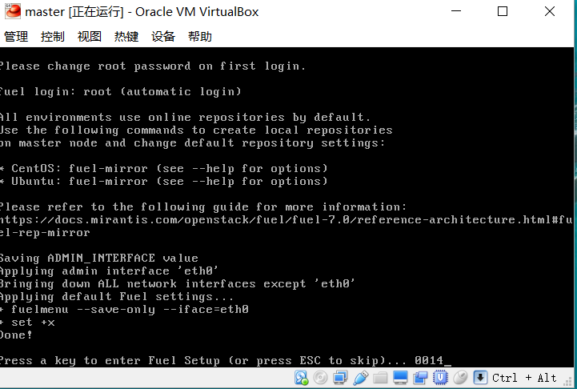

# 部署Fuel
## 选择部署方式

## 按任意键进入Fuel初始化菜单

## 初始设置
1. `Fuel User` 设置Fuel Web密码
2. `Network Setup` 设置Fuel节点IP
3. `PXE Setup` 设置PXE地址池
4. `DNS & Hostname` 设置DNS和主机名
5. `Bootstrap Image` 配置制作bootstrap地址，选择Skip building bootstrap image
6. `Root Password` 配置root密码
7. `Time Sync` 配置时间服务器
8. `Feature groups` 配置Fuel部署的组件，选择： `Advanced features` 和 `Mirantis features`
9. `Shell Login` 
10. `Quit Setup` 保存退出

